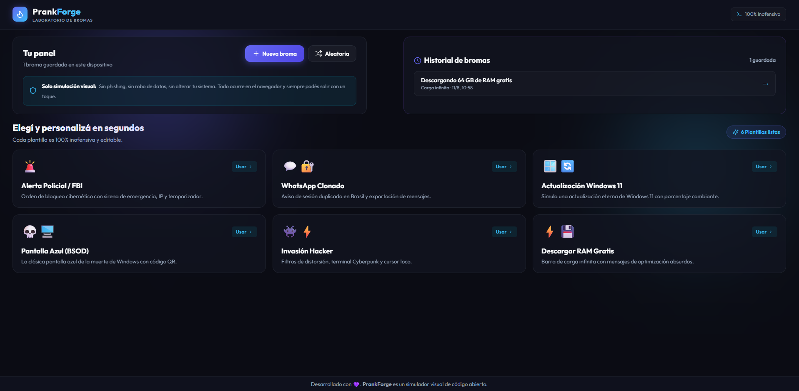
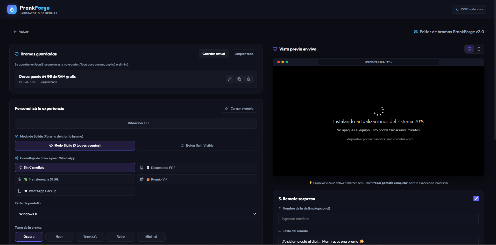
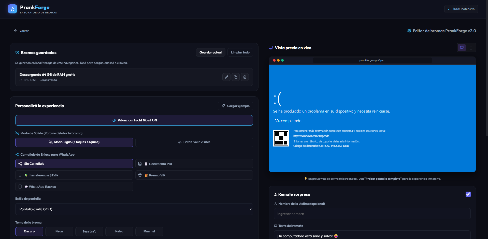
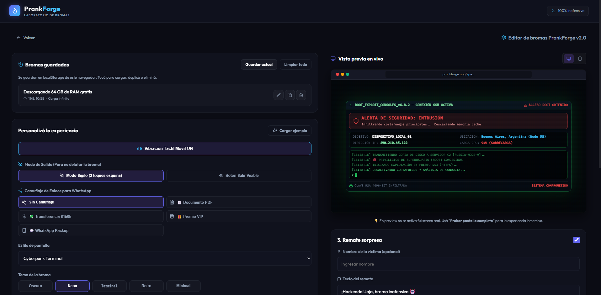

# 🎭 PrankForge v2.0
### *Laboratorio de Bromas Digitales e Interfaces Inmersivas*

  <b>PrankForge</b> es un simulador visual interactivo diseñado para crear bromas digitales realistas, inofensivas y de alto impacto visual. Personalizá escenarios de alertas de seguridad, desvinculaciones de cuentas, consolas hacker e invasiones cibernéticas con vista previa en tiempo real.

---

## 🖼️ Galería de Capturas

<table width="100%">
  <tr>
    <td width="50%" align="center">
      
       
      <b>Panel Principal & Catálogo de Plantillas</b>
    </td>
    <td width="50%" align="center">
      
       
      <b>Editor en Tiempo Real & Historial de Bromas</b>
    </td>
  </tr>
  <tr>
    <td width="50%" align="center">
      
       
      <b>Alerta Policial / FBI Hiperrealista</b>
    </td>
    <td width="50%" align="center">
      
       
      <b>WhatsApp Clonado & Notificación de Seguridad</b>
    </td>
  </tr>
</table>

---

## ✨ Características Principales

- 🚨 **Alerta Policial / FBI Hiperrealista**: Balizas de emergencia en vivo, indicador parpadeante de cámara frontal activada, ficha forense con IP/MAC y código legal simulado.
- 💬 **WhatsApp Clonado**: Notificación oficial con estética de *WhatsApp Security Center*, dispositivo vinculado (`WhatsApp Web / macOS`) y contadores en vivo de chats, imágenes y audios.
- 👾 **Invasión Hacker / Consola SSH**: Consola de ciberseguridad profesional, volcado de memoria en hexadecimal en vivo y secuencia de logs de vulnerabilidad en tiempo real.
- 📍 **Ubicación de Víctima Personalizable**: Proyección en tiempo real del lugar de la víctima configurado desde el editor.
- 📱 **Vista Previa Adaptativa (Desktop & Mobile)**: Previsualización simultánea y adaptable a pantallas móviles con un solo clic.
- 🔗 **Camuflaje de Enlaces**: Generación de enlaces disimulados como comprobantes PDF, transferencias bancarias o respaldos de chat.
- 💾 **Historial Local & Persistencia**: Guardado automático de borradores y plantilla de bromas personalizadas en `localStorage`.
- 🔕 **Experiencia Inofensiva & Silenciosa**: Sin sonidos invasivos ni efectos genéricos, enfocado 100% en la credibilidad visual.

---

  Desarrollado para entretenimiento inofensivo • PrankForge v2.0

